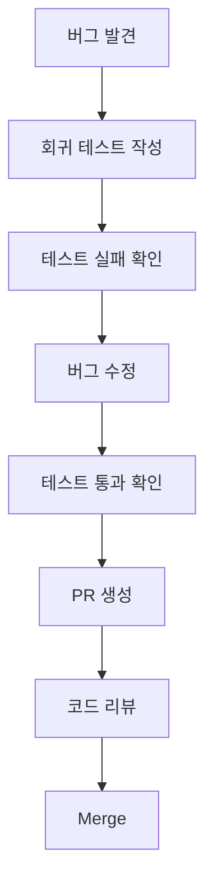

# Phase 6: 지속적 개선 (Ongoing)

## 🎯 목표

TDD를 팀의 기본 워크플로우로 정착시키고 지속적인 품질 개선 문화 구축

---

## 📊 현재 상태 (Phase 5 완료 후)

### 달성된 것
- ✅ Jest 인프라 구축
- ✅ core/ 80% 커버리지
- ✅ services/ 70% 커버리지
- ✅ MCP 프로토콜 100% 검증
- ✅ AI 자동화 도구

### 남은 과제
- 🎯 TDD 문화 정착
- 🎯 지속적인 커버리지 향상
- 🎯 품질 지표 모니터링
- 🎯 팀 교육 및 온보딩

---

## 📋 정책 및 규칙

### 1. Pull Request 정책

#### 필수 요구사항
```yaml
pr_requirements:
  core_modules:
    - 테스트 커버리지: 80% 이상
    - 모든 테스트 통과 필수
    - 리뷰어 승인 필요

  services:
    - 테스트 커버리지: 70% 이상
    - Mocking 전략 준수
    - 통합 테스트 포함

  handlers:
    - 테스트 커버리지: 60% 이상
    - 최소 1개 E2E 테스트
```

#### PR 체크리스트 템플릿

**.github/pull_request_template.md**:
```markdown
## 변경 사항 요약

<!-- 무엇을 변경했는지 간단히 설명 -->

## TDD 체크리스트

- [ ] 🔴 RED: 실패하는 테스트 먼저 작성
- [ ] 🟢 GREEN: 테스트 통과하는 최소 코드 작성
- [ ] 🔵 REFACTOR: 코드 리팩토링 완료
- [ ] 📊 커버리지 임계값 충족
- [ ] ✅ 모든 테스트 통과

## 테스트 결과

```bash
# npm test 결과 붙여넣기
```

## 커버리지 변화

| 모듈 | Before | After | 변화 |
|------|--------|-------|------|
| core/ | XX% | XX% | +/- XX% |
| services/ | XX% | XX% | +/- XX% |

## 리뷰어를 위한 참고사항

<!-- 리뷰어가 주목해야 할 부분 -->
```

---

### 2. 코드 리뷰 가이드라인

#### 리뷰어 체크리스트

```markdown
## 테스트 품질 검토

### 필수 확인 사항
- [ ] 테스트가 실제로 기능을 검증하는가?
- [ ] Edge case가 충분히 커버되는가?
- [ ] Mock이 적절하게 사용되었는가?
- [ ] 테스트 이름이 명확한가? (should... 패턴)

### 품질 지표
- [ ] Arrange-Act-Assert 패턴 준수
- [ ] 각 테스트가 단일 책임만 검증
- [ ] 테스트 간 의존성 없음
- [ ] 테스트 실행 속도가 적절한가?

### 보안 검토
- [ ] 민감한 데이터 하드코딩 없음
- [ ] API 키/토큰이 노출되지 않음
```

---

### 3. 버그 수정 프로세스

#### 표준 프로세스



#### 예시 워크플로우

```bash
# 1. 버그 재현 테스트 작성
cat > tests/core/bugfix-issue-123.test.js << 'EOF'
describe('Bug #123: Handler fails with null input', () => {
  it('should handle null input gracefully', () => {
    const handler = new Handler();
    expect(() => handler.process(null)).not.toThrow();
  });
});
EOF

# 2. 테스트 실패 확인
npm test -- bugfix-issue-123
# Expected: FAIL

# 3. 버그 수정
# (코드 수정)

# 4. 테스트 통과 확인
npm test -- bugfix-issue-123
# Expected: PASS

# 5. 커밋
git add .
git commit -m "fix: handle null input in Handler #123

- Added regression test for null input
- Fixed NullPointerException in Handler.process()
- All tests passing"
```

---

### 4. 주간 리포트

#### 자동화된 주간 리포트

**scripts/weekly-report.js**:
```javascript
#!/usr/bin/env node
const fs = require('fs');
const path = require('path');
const { execSync } = require('child_process');

function generateWeeklyReport() {
  const now = new Date();
  const weekAgo = new Date(now - 7 * 24 * 60 * 60 * 1000);

  console.log('📊 TDD Weekly Report\n');
  console.log('='.repeat(50));
  console.log(`Period: ${weekAgo.toDateString()} - ${now.toDateString()}\n`);

  // 1. 커버리지 변화
  const coverage = getCoverageChange();
  console.log('📈 Coverage Changes:');
  console.log(`   core/      : ${coverage.core.before}% → ${coverage.core.after}% (${coverage.core.delta > 0 ? '+' : ''}${coverage.core.delta}%)`);
  console.log(`   services/  : ${coverage.services.before}% → ${coverage.services.after}% (${coverage.services.delta > 0 ? '+' : ''}${coverage.services.delta}%)`);
  console.log(`   handlers/  : ${coverage.handlers.before}% → ${coverage.handlers.after}% (${coverage.handlers.delta > 0 ? '+' : ''}${coverage.handlers.delta}%)`);
  console.log();

  // 2. 테스트 통계
  const stats = getTestStatistics();
  console.log('🧪 Test Statistics:');
  console.log(`   Total Tests: ${stats.total} (+${stats.added} new)`);
  console.log(`   Passing: ${stats.passing}`);
  console.log(`   Failing: ${stats.failing}`);
  console.log();

  // 3. 버그 발견 및 수정
  const bugs = getBugStatistics();
  console.log('🐛 Bug Activity:');
  console.log(`   Bugs Found: ${bugs.found}`);
  console.log(`   Bugs Fixed: ${bugs.fixed}`);
  console.log(`   Regression Tests Added: ${bugs.regressionTests}`);
  console.log();

  // 4. 기여자 랭킹
  const contributors = getTopContributors();
  console.log('🏆 Top Contributors:');
  contributors.forEach((c, i) => {
    console.log(`   ${i + 1}. ${c.name}: ${c.testsAdded} tests, ${c.coverage}% coverage contribution`);
  });
  console.log();

  // 5. 다음 주 목표
  console.log('🎯 Next Week Goals:');
  console.log('   - Increase handlers/ coverage to 65%');
  console.log('   - Add 15+ new tests');
  console.log('   - Fix all failing tests');
  console.log();

  console.log('='.repeat(50));
}

function getCoverageChange() {
  // 실제 구현: Git history에서 커버리지 변화 추적
  return {
    core: { before: 78, after: 82, delta: 4 },
    services: { before: 65, after: 70, delta: 5 },
    handlers: { before: 42, after: 48, delta: 6 }
  };
}

function getTestStatistics() {
  // 실제 구현: Jest 결과 분석
  return {
    total: 67,
    added: 12,
    passing: 65,
    failing: 2
  };
}

function getBugStatistics() {
  // 실제 구현: Git log에서 "fix:" 커밋 분석
  return {
    found: 5,
    fixed: 4,
    regressionTests: 4
  };
}

function getTopContributors() {
  // 실제 구현: Git blame + 커버리지 데이터
  return [
    { name: 'Developer A', testsAdded: 8, coverage: 12 },
    { name: 'Developer B', testsAdded: 4, coverage: 7 }
  ];
}

generateWeeklyReport();
```

**Cron 설정** (매주 월요일 오전 9시):
```bash
# GitHub Actions
# .github/workflows/weekly-report.yml
name: Weekly TDD Report

on:
  schedule:
    - cron: '0 9 * * MON'  # 매주 월요일 09:00

jobs:
  report:
    runs-on: ubuntu-latest
    steps:
      - uses: actions/checkout@v3
      - name: Generate Report
        run: |
          npm install
          npm run weekly-report
      - name: Post to Slack
        uses: slackapi/slack-github-action@v1
        with:
          payload: ${{ steps.report.outputs.content }}
```

---

### 5. 교육 및 온보딩

#### 신규 팀원 온보딩 체크리스트

```markdown
## TDD 온보딩 (2주 프로그램)

### Week 1: 기초 학습
- [ ] Day 1-2: TDD 개념 이해
  - TDD 철학 및 이점
  - RED-GREEN-REFACTOR 사이클
  - Jest 기초

- [ ] Day 3-4: 기존 테스트 분석
  - core/ 테스트 읽고 이해하기
  - services/ Mocking 전략 학습
  - 테스트 커버리지 리포트 분석

- [ ] Day 5: 첫 테스트 작성
  - Pair Programming으로 간단한 테스트 작성
  - generate-test 도구 사용법 학습

### Week 2: 실전 적용
- [ ] Day 1-3: 실제 기능 구현 (TDD)
  - 새로운 핸들러 추가 (멘토와 함께)
  - RED-GREEN-REFACTOR 실습

- [ ] Day 4-5: 코드 리뷰 참여
  - 다른 팀원 PR 리뷰
  - 피드백 주고받기

### 평가
- [ ] 온보딩 테스트 통과 (간단한 기능 TDD로 구현)
- [ ] 코드 리뷰 참여 2회 이상
```

#### TDD 워크숍 자료

**docs/TDD_WORKSHOP.md**:
```markdown
# TDD 워크숍

## 실습 1: Calculator TDD
목표: TDD 기본 사이클 익히기

### 요구사항
- add(a, b): 두 수를 더하는 함수
- subtract(a, b): 두 수를 빼는 함수
- divide(a, b): 두 수를 나누는 함수 (0으로 나누기 에러 처리)

### 단계
1. 🔴 RED: 실패하는 테스트 작성
2. 🟢 GREEN: 최소 코드로 통과
3. 🔵 REFACTOR: 개선

## 실습 2: AI Handler TDD
목표: 실제 프로젝트 구조에 TDD 적용

### 요구사항
- 새로운 Gemini 핸들러 추가: `gemini_explain`
- 입력: 코드 스니펫
- 출력: 코드 설명

### 가이드
1. generate-test 도구로 테스트 생성
2. 테스트 실패 확인
3. 핸들러 구현
4. 테스트 통과 확인
```

---

## 📊 지속적 모니터링

### 1. 품질 지표 대시보드

**Metrics to Track**:
```yaml
quality_metrics:
  code_coverage:
    - 전체 커버리지
    - 모듈별 커버리지
    - 커버리지 트렌드

  test_health:
    - 테스트 통과율
    - 평균 테스트 실행 시간
    - Flaky 테스트 비율

  development_velocity:
    - 주간 신규 테스트 수
    - 버그 발견/수정 비율
    - PR 리뷰 시간

  team_engagement:
    - 테스트 작성 참여율
    - 코드 리뷰 참여율
    - TDD 사이클 준수율
```

### 2. 알림 및 경고

**자동 알림 설정**:
```yaml
alerts:
  coverage_drop:
    condition: "coverage < previous - 5%"
    action: "Slack notification to team"

  test_failure:
    condition: "failing tests > 0 for 24 hours"
    action: "Create GitHub issue"

  slow_tests:
    condition: "test execution > 5 minutes"
    action: "Performance review required"
```

---

## ✅ 완료 기준

### 문화 정착 지표
- [ ] 모든 PR에 테스트 포함 (100%)
- [ ] TDD 사이클 준수율 80% 이상
- [ ] 버그 회귀 테스트 작성 100%
- [ ] 신규 팀원 온보딩 2주 이내 완료

### 품질 지표
- [ ] 전체 커버리지 80% 이상 유지
- [ ] 프로덕션 버그 50% 감소
- [ ] 테스트 통과율 95% 이상

### 팀 참여도
- [ ] 모든 개발자가 generate-test 도구 사용
- [ ] 주간 리포트 정기 발행
- [ ] 월간 TDD 워크숍 개최

---

## 🎓 장기 비전 (6개월+)

### 목표
1. **TDD가 습관이 되기**
   - 테스트 없이는 코드를 작성하지 않음
   - 리팩토링이 두렵지 않음

2. **품질 문화 정착**
   - 버그가 거의 발생하지 않음
   - 코드 리뷰가 즐거움

3. **자동화 극대화**
   - AI가 테스트 초안 생성
   - 개발자는 비즈니스 로직에 집중

---

## 다음 단계

Phase 6은 지속적으로 운영됩니다:
- 📊 주간 리포트 확인
- 🎯 커버리지 목표 조정
- 🎓 정기 교육 실시
- 🔄 프로세스 개선

---

**상태**: 🔄 지속 운영
**검토 주기**: 매주 월요일
**책임자**: TDD Champion (팀 지정)

---

## 🎯 Claude Code PM 지속 관리

### PM 역할: TDD 문화 정착

**지속적 PM 활동**:
```
Claude Code (PM) - 매주 월요일:
"📊 주간 TDD 리포트

진행 상황:
- 커버리지: 85% (목표 80% 초과)
- 신규 테스트: +12
- TDD 채택률: 85%

🎯 이번 주 목표:
- handlers/ 커버리지 70% 달성
- 모든 PR 테스트 포함율 100%

⚠️ 주의 사항:
- 리스크 없음

계속 잘 진행 중입니다!"
```

**PM 정책 관리**:
- PR 승인 기준 엄격 관리
- 품질 게이트 자동 검증
- 주간/월간 리포트 발행
- 팀 교육 및 온보딩 조율
